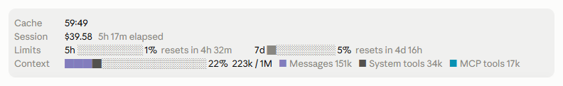

# session-band

Session figures in the band directly above the Claude Code prompt, on the terminal and in the desktop app's Code tab:



- Cache: time left before the main thread's prompt cache expires, counted from the start of the last main-thread request that read or wrote the cache, since generation time counts against the cache lifetime. After a session is resumed or forked, the plugin has no request start time, only the time the last response finished (Claude Code's SessionStart field `seconds_since_last_response`), so the restored countdown is an estimate that can run long by up to that response's generation time and is shown followed by the word `estimated` in dim text, for example `4:00  estimated`, until the next main-thread response that reads or writes the cache replaces it with the exact countdown. When Claude Code reports on resume that the prompt cache has likely expired, the row shows `expired` instead.
- Session: the session's API-priced cost and how long it has run.
- Limits: each rate-limit window the API reports, with a usage bar and the time to its reset. Windows the plugin does not name (an organization spend limit, for example) show under their raw kind. The row is hidden until the first response of the session reports a reading.
- Context: the context window fill, split by the largest categories in `/context`'s colors.

## Requirements

Function hooks are an early-access Claude Code API that may change between releases without notice. CI tests this plugin on Claude Code 2.1.288. If the band does not appear, update Claude Code; a build where function hooks are still off by default needs `CLAUDE_CODE_ENABLE_FUNCTION_HOOKS=1` in its environment.

## Install

```sh
claude plugin marketplace add crane-valley/claude-plugins
claude plugin install session-band@crane-valley
```

## Options

Set them with `/plugin configure session-band@crane-valley`, in `/config`, or with `--config KEY=VALUE` on `claude plugin install`. Unset options take the defaults below.

| Option | Default | Meaning |
| --- | --- | --- |
| `cacheTtl` | `5m` | The prompt cache TTL your main thread uses (`5m` or `1h`). The plugin cannot read it from Claude Code, so a wrong value shows a wrong countdown. |
| `showCost` | `true` | Show the session's cost. On a subscription this is the API price of the usage, not what you are billed. |

## Sharing the band

The band above the prompt is one slot shared by every plugin. session-band appends its rows to whatever the plugins beneath it drew, so other plugins' rows stay visible; a plugin that draws the band without calling `next(e)` hides the ones beneath it.

## License

MIT
